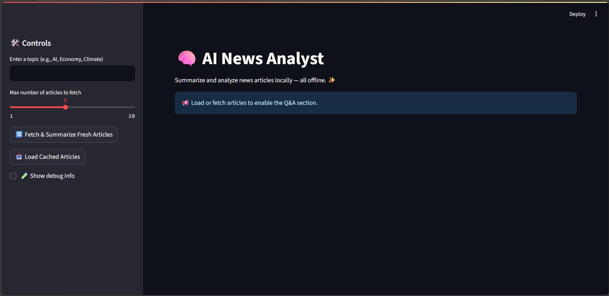
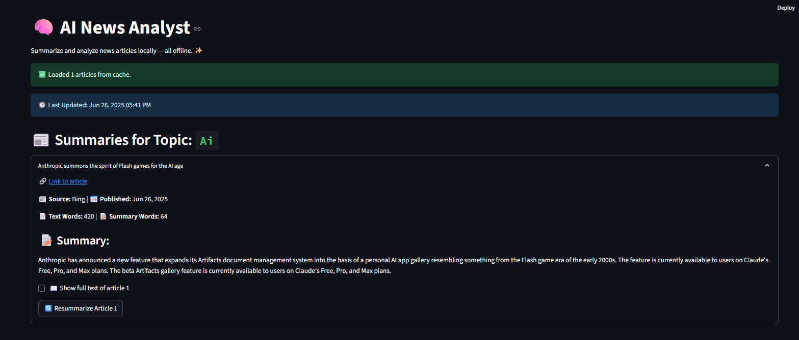
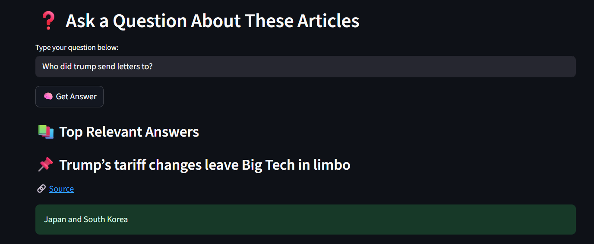

# 🧠 AI News Analyst Tool

_A local, modular AI-powered pipeline to fetch, summarize, and analyze news articles — all offline._

---

## Project Overview

The AI News Analyst is designed to provide an end-to-end solution for fetching, summarizing, and answering questions about news articles on user-specified topics — all running locally on modest hardware without internet dependency or paid APIs.

This project demonstrates how modern NLP models can be integrated efficiently in a CPU-only environment to deliver practical, interactive news analytics.

---

## Features

- **Multi-source news fetching:**  
  Fetches news articles primarily from Bing RSS feeds, with Yahoo RSS as a fallback.  
  Resolves real URLs, deduplicates articles, and stores structured metadata.

- **Robust content extraction:**  
  Uses `newspaper3k` as the primary extraction tool, with `trafilatura` fallback for tricky pages.  
  Employs relevance filtering and relaxed content quality checks to maximize usable articles.

- **Generative summarization:**  
  Utilizes a local quantized Flan-T5-base model via Hugging Face Transformers for detailed, factual summaries (~200-250 words).  
  Implements chunking and prompt engineering to optimize summary quality.

- **Semantic search & question answering:**  
  Applies semantic filtering (using Sentence Transformers) to select the most relevant articles for user questions.  
  Uses the same local generative model to answer questions based on article summaries and full texts.

- **Interactive Streamlit UI:**  
  Allows users to input topics, fetch and summarize articles, load cached summaries, and ask questions.  
  Supports dynamic resummarization of individual articles for improved quality without restarting the pipeline.

---

## Architecture and Workflow

1. **Fetching**  
   Pulls top articles for the topic from Bing RSS, fills gaps with Yahoo RSS, then resolves and deduplicates URLs.

2. **Extraction**  
   Downloads article content with fallback extraction methods. Filters out unusable or irrelevant content.

3. **Summarization**  
   Splits long texts into manageable chunks, summarizes each chunk, then optionally compresses the combined summary.

4. **Storage**  
   Saves summaries, full text, and metadata locally in JSON files for offline use.

5. **Question Answering**  
   Embeds the user question and article summaries to find the best matches.  
   Generates detailed answers from selected articles.

---

## Screenshots

### Main Interface



### Article Summary View with Resummarize Button



### Question Answering Section



---

## Installation and Setup

1. Clone the repository:

   ```bash
   git clone https://github.com/yourusername/ai-news-analyst.git
   cd ai-news-analyst

2. Create and activate a virtual environment:

   ```bash
    python -m venv news_env
    source news_env/bin/activate  # Linux/Mac
    news_env\Scripts\activate     # Windows

3. Instal dependencies:

   ```bash
    pip install -r requirements.txt

4. Run Streamlit App:

   ```bash
    streamlit run app.py
